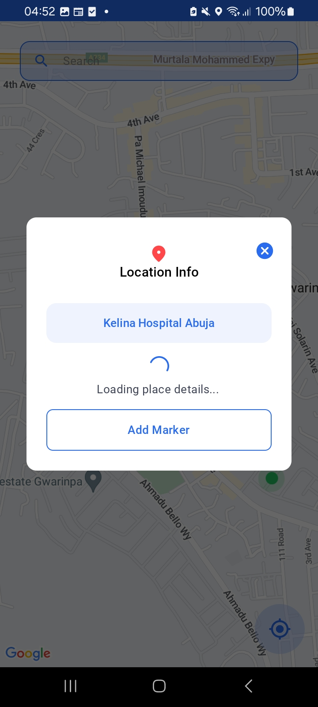

<h1 align="center">Drovox</h1>

<p align="center"><a href="https://www.drovox.com"></a> </p>

<p align="center">
  <a href="https://www.android.com/"></a>
  <a href="https://opensource.org/licenses/Apache-2.0"></a>
  <a href="https://android-arsenal.com/api?level=26"></a>
   <a href="https://github.com/abdulwahabhassan/drovox/actions"></a> 
</p>

<p align="center">Drovox lets you see your location, add, remove and search markers with a daily 9 AM reminder to rise and shine!</p>

## Preview

|            |            |            |            |            |
|------------|------------|------------|------------|------------|
|  |  |  |  |  |

## Configurations
- Minimum SDK level 26
- Compile SDK version 34
- Target SDK version 34
- Version code 1
- Version name "1.0"

## Tech stack & libraries
- [Kotlin](https://kotlinlang.org/), [Coroutines](https://github.com/Kotlin/kotlinx.coroutines) + [Flow](https://kotlin.github.io/kotlinx.coroutines/kotlinx-coroutines-core/kotlinx.coroutines.flow/) for asynchronous operations and background processes.
- Jetpack
  - Lifecycle - Observe Android lifecycles and handle UI states upon the lifecycle changes.
  - ViewModel - Manages UI-related data holder and lifecycle aware. Allows data to survive configuration changes such as screen rotations.
  - Room - Constructs Database by providing an abstraction layer over SQLite to allow fluent database access.
  - DataStore - Data storage solution for key-value pairs or typed objects with protocol buffers.
  - Hilt - Manage dependency injection.
- Architecture
  - MVVM (Model - View - ViewModel) + MVI (Model - View - Intent) Architecture
  - Repository Pattern
- Network & HTTP Connectivity
  - [Retrofit2 & OkHttp3](https://github.com/square/retrofit) - Construct the REST APIs.
- Logger & Debugging Tools
  - [Timber](https://github.com/JakeWharton/timber) - A logger with a small, extensible API.
- Design Framework
  - [Material-Components](https://github.com/material-components/material-components-android) - Material design components for building ripple animation, and CardView.
- UI Framework
  - Jetpack Compose
  - [Material 3]()
- [Google Map](https://mapsplatform.google.com/) - Locations
  
## App Architecture
This app is based on an MVVM + MVI hybrid architecture and the Repository pattern.
The app is also modularized so that there is the app module, the core modules and the feature modules.
Stateflow is emitted from the view model to the views that observe these changes and react accordingly in a compose fashion.

## License
```xml
This source code is distributed under the terms of the Apache License (Version 2.0)
```
